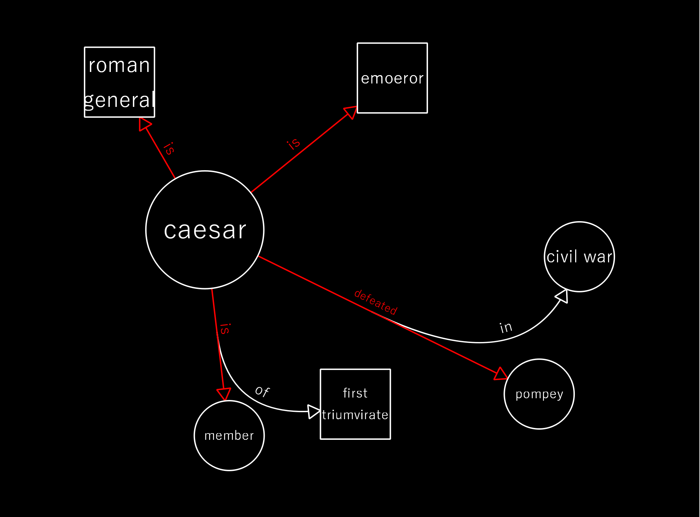

# Welcome to NetX2!
This is a node graph inspired application for note taking and other visual tasks\
Users can create nets, edit nets, and navigate nets.\
With inbuilt Natural language Processing, entering in sentences creats mini nets\
The net supports:
- Indirect and direct relationships

- Cyclic paths
- Multiple sources and destinations for relationships
- Relationship on Relationship paths